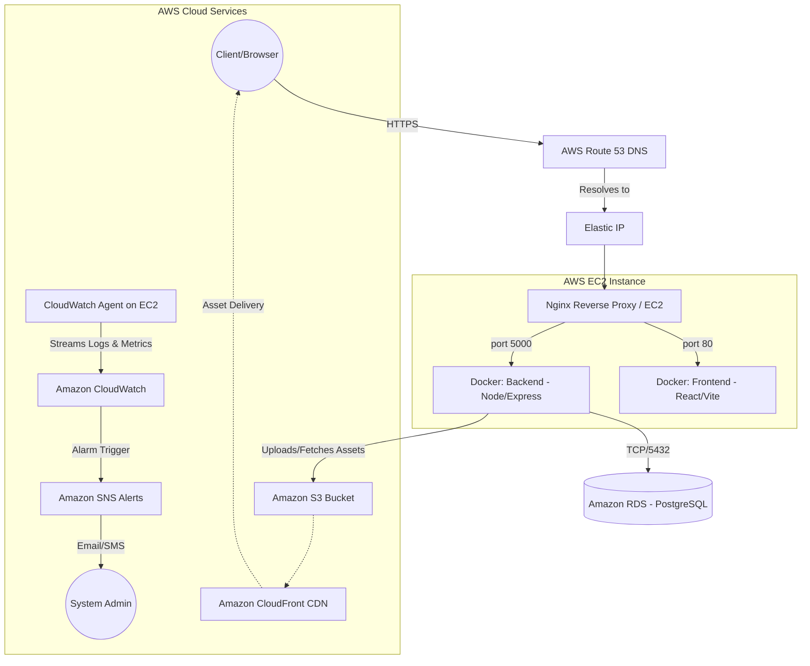

# TaskFlow Cloud Architecture Diagram

This diagram visualizes the infrastructure flow for the TaskFlow application deployed on AWS.

```mermaid
graph TD
    Client((Client/Browser)) -->|HTTPS| Route53[AWS Route 53 DNS]
    Route53 -->|Resolves to| EIP[Elastic IP]
    EIP --> NGINX[Nginx Reverse Proxy / EC2]

    subgraph AWS EC2 Instance [AWS EC2 Instance]
        NGINX -->|port 80| Frontend[Docker: Frontend - React/Vite]
        NGINX -->|port 5000| Backend[Docker: Backend - Node/Express]
    end

    Backend -->|TCP/5432| RDS[(Amazon RDS - PostgreSQL)]
    
    subgraph AWS Services [AWS Cloud Services]
        Backend -->|Uploads/Fetches Assets| S3[Amazon S3 Bucket]
        S3 -.-> CloudFront[Amazon CloudFront CDN]
        CloudFront -.->|Asset Delivery| Client
        
        EC2_Agent[CloudWatch Agent on EC2] -->|Streams Logs & Metrics| CloudWatch[Amazon CloudWatch]
        CloudWatch -->|Alarm Trigger| SNS[Amazon SNS Alerts]
        SNS -->|Email/SMS| Admin((System Admin))
    end
```
